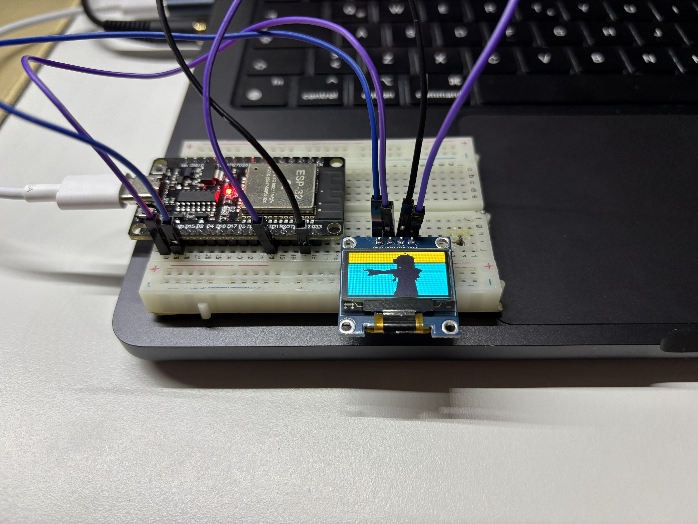

# ESP32_BadApple

Bad Apple video by Touhou on ESP32 with SSD1306 OLED, uses the Heatshrink compression library to decompress the RLE encoded video data.
First version, no sound yet, video only.



## Hardware Requirements

Runs on ESP32 modules with OLED displays based on SSD1306. Typical modules are available from Heltec or TTGO or others.

## Software Requirements

- PlatformIO IDE (VS Code extension)
- ESP32 platform
- OLED display driver from https://github.com/ThingPulse/esp8266-oled-ssd1306
- Heatshrink decompression library (included in `src/`)

# Usage

## Setup

1. **Install PlatformIO** in VS Code
2. **Open this project** in VS Code
3. **Configure your board** in `platformio.ini`:
   - Set correct `upload_port` and `monitor_port` (e.g., `/dev/cu.usbserial-10`)
   - Match Flash Size to Partition Scheme in your board settings
   - Default uses "8M with spiffs (3MB APP/1.5MB SPIFFS)"

## Project Structure

```
ESP32_BadApple/
├── data/
│   └── video.hs          # Compressed video file (upload to SPIFFS)
├── src/
│   ├── main.cpp          # Main sketch
│   ├── heatshrink_*.cpp  # Heatshrink decompression library
│   └── heatshrink_*.h    # Heatshrink headers
└── platformio.ini        # Project configuration
```

## Upload Instructions

1. **Adapt display pins** in `src/main.cpp` if necessary (default: SDA=4, SCL=15)
2. **Upload code** to ESP32:
   - Click the **→ Upload** button in VS Code status bar
   - Or run: `platformio run --target upload`
3. **Upload SPIFFS filesystem** with video data:
   - PlatformIO → PROJECT TASKS → esp32 → Platform → **Upload Filesystem Image**
   - Or run: `platformio run --target uploadfs`

## Running

- Video plays automatically on boot
- Press **PRG button (GPIO0)** for max display speed (limited by I2C transfer)
- Otherwise runs at 30 fps

Enjoy video. Pressing PRG button (GPIO0) for max display speed (mainly limited by I2C transfer), otherwise limited to 30 fps.

# How does it work

Video have been separated into >6500 single pictures, resized to 128x64 pixels using VLC.
Python skript used to run-length encode the 8-bit-packed data using 0x55 and 0xAA as escape marker and putting all into one file.
RLE file has been further compressed using heatshrink compression for easy storage into SPIFFS (which can hold only 1MB by default).
Heatshrink for Arduino uses ZIP-like algorithm and is available also as a library under https://github.com/p-v-o-s/Arduino-HScompression and
original documentation is here: https://spin.atomicobject.com/2013/03/14/heatshrink-embedded-data-compression/

# Troubleshooting

## SPIFFS Mount Failed

If you see "SPIFFS mount failed" error:

1. **Check Partition Scheme**: Ensure Flash Size matches Partition Scheme in `platformio.ini`
   - 4MB Flash → use 4MB partition (e.g., "default.csv")
   - 8MB Flash → use 8MB partition
2. **Format on first boot**: Change `SPIFFS.begin(false)` to `SPIFFS.begin(true)` in `main.cpp`
3. **Upload filesystem**: Make sure you ran `platformio run --target uploadfs`
4. **Erase flash**: Run `pio run --target erase` then re-upload code and filesystem
